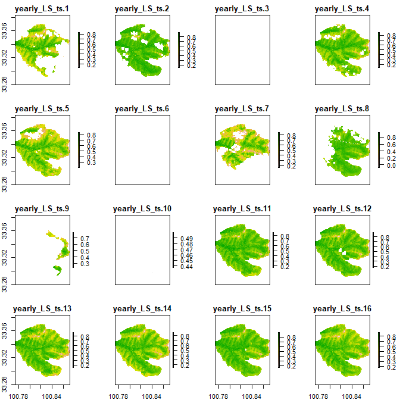
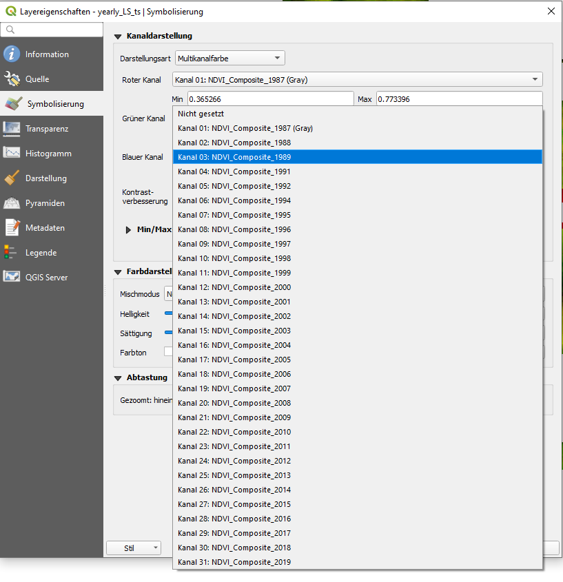
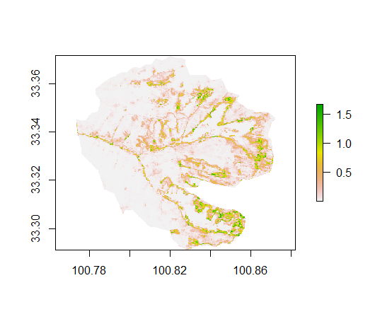
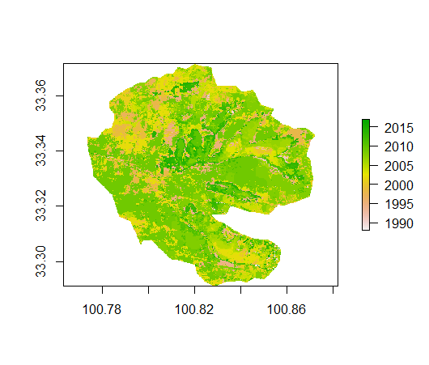
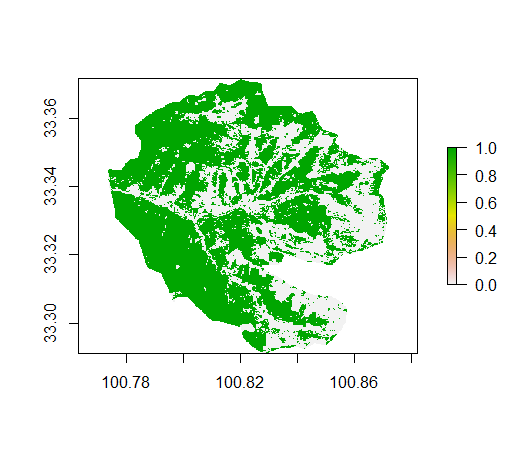
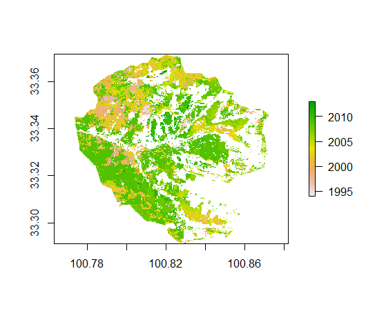

## Preparing annual time series data stacks with Google Earth Engine and conducting time series analysis in R##

### Overview ###

After getting to know the Google Earth Engine (GEE) in the last practical session of the course, you will today learn to use the GEE to manipulate the satellite image collections directly in the GEE cloud to derive an annual time series of Landsat NDVI values acquired only for certain months of a year. In comparison to what we learned last week, this requires some additional coding in the GEE environment. Exporting annual satellite image mosaics instead of simply exporting all available data (as we did last week), brings some advantages such as (a) the possibility to exclude seasonality from the signal, (b) to account for local data gaps by temporal interpolation and (c) to notably reduce the size of the exported data.

When preparing the material for this Tutorial, I came across a technical report of Pironkova et al. 2018 (you can find the document on ILIAS) which matches very well the contents I wanted to communicate in this tutorial. Hence, most of the code you will find below is based on the code provided by this technical report. I only added some lines of code, which I will describe further below. Please have a look at this technical report along with this Tutorial as you might find valuable additional information there.

In the second part of the tutorial we will further process the the annual vegetation index time series in R to detect monotonic trends and change points. These steps were again mostly based on the analyses suggested in Pironkova et al. 2018 but I added one more analysis to conduct a Pettitt test to identify turning points. More information below.

### Learning objectives ###

The learning objectives of this Tutorial include:

- deepening our capabilities to manipulate large amounts of satellite data in the GEE
- learn how to prepare and export annual vegetation index time series in the GEE (considering data only from certain phenological stages/time periods of the year)
- applying simple time-series analysis tests and trends in R to full images (instead of to single pixels)

### Datasets used in this Tutorial ###

The only dataset required in this Tutorial is a shapefile defining the boundary of the examined study area which is a grassland area on the Qinghai Tibetan Plateau in which notable grassland degradations took place over the last few decades. The Shapefile outlines the area of the winter pastures of a Tibetan village for which some in-depth studies have been conducted (see for example Li et al. 2017 - provided in ILIAS to some more detailed background information):

-- add link to Shapefile here --

### Step 1: Annual NDVI mosaics in the GEE

Last week, we for the first time had a look at the GEE and I assume that you are all already familiar with the basic functionalities of the code editor. In the following, I will present step-by-step the code and functions that are necessary to derive annual mosaics of Landsat-based NDVI values. The code can of course easily be adapted to derive the same mosaics for other vegetation indices that can be derived from Landsat data.

You might remember from last week, that typically the raw Landsat data are pre-processed to eliminate unwanted observation, such as pixels affected by clouds or snow. In this code example, we are working with today, these pre-processing steps are a bit more sophisticated and aside the cloud-mask functions, two more functions are used to eliminated saturated pixels (more than 100% reflectance) and areas affected by large aerosol concentrations. The corresponding functions either directly use the input bands for calculating NDVI (for the saturation function) or the pixel_quality band that is delivered with each atmospherically corrected Landsat scene (and which is avaiable if the surface reflectance products of Landsat are used in GEE). The corresponding codes in the GEE looks like this:

	//--------------------------------------------//
	// 1. QA FUNCTIONS //
	//--------------------------------------------//
	//SATURATES MASK (L5/7)
	var maskSaturate57 = function(image){
	image = image.select('B3', 'B4');
	var mask = image.lt(10000).and(image.gte(0));
	return image.updateMask(mask);
	}
	
	//SATURATES MASK (L8)
	var maskSaturate8 = function(image){
	image = image.select('B4', 'B5');
	var mask = image.lt(10000).and(image.gte(0));
	return image.updateMask(mask);
	}
	
	//PIXEL MASK (L8)
	var maskPixels8 = function(image){
	var pixel_qa = image.select('pixel_qa');
	var mask = pixel_qa.eq(322);
	return image.updateMask(mask);
	}
	
	//PIXEL MASK (L5/L7)
	var maskPixels57 = function(image){
	var pixel_qa = image.select('pixel_qa');
	var mask = pixel_qa.eq(66);
	return image.updateMask(mask);
	}
	
	//AEROSOL MASK (L8)
	var maskAerosol = function(image){
	var aero_qa = image.select('sr_aerosol'); var mask = aero_qa.neq(194).and(aero_qa.neq(224)).and(aero_qa.neq(160)).and(aero_qa.neq( 130));
	return image.updateMask(mask); } 
	//ATMOS OPACITY MASK (L5/L7) -to get rid of haze 
	var maskHaze = function(image){
	//Select band and multiply by scaling factor
	var atmos_qa = image.select('sr_atmos_opacity').multiply(0.0010);
	//Mask for non-hazy pixels and remove fill vals
	var mask = atmos_qa.lte(0.1).and(atmos_qa.gt(-9.9));
	return image.updateMask(mask)
	}

The next function are required for calculating the NDVI for Landsat 5,7 and 8 images:

	//----------------------------------------------//
	// 2. NDVI FUNCTIONS //
	//----------------------------------------------//
	//NDVI FUNCTIONS
	var getNDVI57 = function(image) {
	//Apply saturate function
	image = maskSaturate57(image);
	var nir = image.select('B4');
	var red = image.select('B3');
	var ndvi = nir.subtract(red).divide(nir.add(red)).rename('nd');
	return(ndvi);
	}
	var getNDVI8 = function(image){ 
	  //Apply saturate function 
	  image = maskSaturate8(image); 
	  var nir = image.select('B5'); 
	  var red = image.select('B4'); 
	  var ndvi = nir.subtract(red).divide(nir.add(red)).rename('nd'); 
	  return(ndvi);
	}

These kind of functions should already look more or less familiar from last week's tutorial. One difference in comparison to last week is, that the bands are pre-processed wth the saturation function defined above, to avoid calculating the NDVI for pixels with impossible reflectance values.

The next function addresses a known issue of the Landsat family: The bands of Landsat 5, 7 and 8 are all slightly shifted in terms of the spectral range. Hence, the NDVI values calculated for Landsat 5, 7 and 8 would not be completely identical even if they would observe exactly the same situation on the ground at the same time and under the exactly same conditions. The difference are not huge, but nevertheless they are there and some correction coefficents have been suggested to correct these differences between the NDVIs. The function below does exactly this to calibrate LS 8 and LS 5 values to LS 7:

	//-----------------------------------------------//
	// 3. SENSOR CALLIBRATION FUNCTIONS //
	//-----------------------------------------------//
	//Coefficient Function (L5)
	var applyCoefficientL5 = function(image){
	var image_adjusted = image.select('nd').multiply(1.036);
	return(image_adjusted); } 
	//Coefficient Function (L8) 
	var applyCoefficientL8 = function(image){
	var image_adjusted = image.select('nd').multiply(1.0863);
	return(image_adjusted); } 

After briefly explaining these helper-functions, we will not concentrate on the main function to create the annual NDVI mosaics. Please have a look through the code given below and check the additional explanations given directly in the code - I marked all parts which are meant to be modified by the user with comments and explanation marks.

	//---------------------------------------------// 
	// 4. MAIN FUNCTION // 
	//---------------------------------------------//
	var createNDVIComposite = function(){ 
	  //Set year range 
	  // !!!! Adjust the years you want to cover here !!!! //
	  var yearrangeStart = 1986; 
	  var yearrangeStop = 2019; 
	  
	  // create an Image list to store the NDVI mosaic of each year (this part of the code
	  // with the Image list was added by myself)
	  var listfin = ee.Image([]);
	  
	  //Loop through years 
	  
	  for(var loopYear = yearrangeStart; loopYear <= yearrangeStop; loopYear +=1){ 
	    
		//Set year's date range //
		// !!!! Adjust the time period you want to cover within each year here !!!! //

	    var start = ee.Date.fromYMD(loopYear, 6, 20); 
	    var end = ee.Date.fromYMD(loopYear, 9, 25); 

	    //Landsat 8 
		// load Landsat 8 surface reflection collection and apply all
		// pre-processing functions
		// and calculate NDVI + apply sensor calibration coefficients

	    var l8 = ee.ImageCollection("LANDSAT/LC08/C01/T1_SR")
	      //Filter AOI (imported at the top)
	      .filterBounds(MainProject)
	      //July and August only
	      .filterDate(start, end)
	      //Filter CLOUD_COVER
	      .filterMetadata('CLOUD_COVER', 'less_than', 80)
	      //Apply Pixel Mask
	      .map(maskPixels8)
	      //Apply Aerosol Mask
	      .map(maskAerosol)
	      //Calculate NDVI
	      .map(getNDVI8)
	      //Apply Sensor Callibration Coefficient
	      .map(applyCoefficientL8);

	    //Landsat7
		// load Landsat 7 surface reflection collection and apply all
		// pre-processing functions
		// and calculate NDVI 

	    var l7 = ee.ImageCollection("LANDSAT/LE07/C01/T1_SR")
	      //Filter AOI (imported at the top)
	      .filterBounds(MainProject)
	      //July and August only
	      .filterDate(start, end)
	      //Filter CLOUD_COVER
	      .filterMetadata('CLOUD_COVER', 'less_than', 100)
	      //Apply Pixel Mask
	      .map(maskPixels57)
	      //Apply Haze Mask
	      .map(maskHaze)
	      //Calculate NDVI
	      .map(getNDVI57);  

	    //Landsat5
		// load Landsat 5 surface reflection collection and apply all
		// pre-processing functions
		// and calculate NDVI + apply sensor calibration coefficients

	    var l5 = ee.ImageCollection("LANDSAT/LT05/C01/T1_SR") 
	      //Filter AOI (imported at the top) 
	      .filterBounds(MainProject) 
	      //July and August only 
	      .filterDate(start, end) 
	      //Filter CLOUD_COVER 
	      .filterMetadata('CLOUD_COVER', 'less_than', 100) 
	      //Apply Pixel Mask 
	      .map(maskPixels57) //Apply Haze Mask 
	      .map(maskHaze) //Calculate NDVI 
	      .map(getNDVI57) //Apply Sensor Callibration Coefficient 
	      .map(applyCoefficientL5);
	    

		//Merge collections
	    var mergedCollection = ee.ImageCollection(l8.merge(l7).merge(l5));
	    
		//Create composite with median, clip to AOI and rename band based on year 
	    var finalOutput = mergedCollection.reduce(ee.Reducer.median()).clip(MainProject).rename(loopYear.toString()); 
	    
		//Generate filename for export 
	    var filename = ("NDVI_Composite_").concat(loopYear.toString()); 
	    
		// add mosaic of current year to image list    
	    listfin = ee.Image(listfin).addBands(finalOutput.rename(filename));
	    
	  //end of loop 

	    }
	    
		// print out the stacked image list to check how many mosaics are contained
	    print(listfin)

		// convert all datasets to the same data type (LS8 has another datatype thatn LS5 and 7)
	    var listfin2 = listfin.toDouble()

	 
		// Export the stack of NDVI mosaics to Google Drive

	    Export.image.toDrive({
	    image: listfin2,
	    description: 'yearly_LS_ts',
	    //Landsat resolution is 30m
	    scale: 30,
	    region: MainProject,
	    //LCC_MNRF projection
	     crs: 'epsg:4326',
	    maxPixels: 800000000
	    })
	    
	 } 

As we prepared the whole code with functions, we now have to run one more line of code to actually call the function that will create the annual mosaic:

	var comp = createNDVIComposite();
	print(comp)

Please also be aware that you additionally have to load and define the Shapefile with the boundary of the study area - otherwise, the code will return an error message. Try to find out yourself which variable name is referring to the Shapefile (Asset) in the code given above and then load the Shapefile (Asset) into the code and assign to the corresponding variable name yourself. In case you do not fully remember how to do this, please check last week's tutorial.

You can access a fully functional version of the code here:

[https://code.earthengine.google.com/d9ec1f094d1a3f3cfd7f7531d0738eae?noload=true](https://code.earthengine.google.com/d9ec1f094d1a3f3cfd7f7531d0738eae?noload=true)

Please run the code and export the resulting annual mosaic to your google drive. We will use the data in Step 2 of the Tutorial. In case you have some sort of troubles running the code, you can access the resulting file also here:

[https://drive.google.com/file/d/1pMELTPLLL9pwsQZ1uY72vgs11hutWBdm/view?usp=sharing](https://drive.google.com/file/d/1pMELTPLLL9pwsQZ1uY72vgs11hutWBdm/view?usp=sharing)

### Step 2: Mann-Kenndal trend test and Theil Sen's slope

As indicated above, large parts of the following code were again taken from the technical report of Pironkova et al. 2018. The code has been mostly prepared by Krystal Lan (lan.krystalt@gmail.com) and Ryan Whaley (rdgwhaley@gmail.com). I changed and added a few lines here and there.

First, we will load all the packages required for analysing our annual NDVI datasets. Please install the packages in case you do not already have them installed:

	# load all required packages
	require(raster)
	require(rkt)
	require(trend)
	require(zoo)

Next, we can set some global raster options which are quite useful. I do not typically use these settings but as it was included in the original code and I found the settings useful, I thought it makes sense to also keep them in the Tutorial:

	rasterOptions(maxmemory=1e+06, chunksize=1e+07, progress = 'text')

With this commant, it is possible to change the general settings of the raster package, in this case two settings are referring to how the raster package handles memory (maximum amount of memory used as well as in which chunk size data is loaded when large files are being processed). This settings are quite interesting to adapt the raster package functionalities a bit to the processing power of the computer you are working with. Finally the command "progress = 'text'" will make the raster package always inform you about the status of the currently conducted calculation with a progress bar. I think this quite handy, particularly if waiting times sometimes are quite long and you are not sure whether the progress is still working of the computer has crashed.

Next, we will load our annual Landsat based NDVI mosaics we just created sing the GEE and apply a Mann-Kendall-trend test to each pixel of our time series. First we load the data and prepare an output folder. We load the data with the command "brick()" as this will have some computational advances for some of the functions applied below.

	##################################
	##MK-test + Seasonal and Regional Kendall tests (SKT / RKT) + Theil-Sen's Slope estimator
	##################################
	# Set working directory (location of rasters)
	setwd("D:/Multiskalige_FE/5_Practicals/Tag_7_time_series")
	# Set output directory (where the results will go)
	results <-"D:/Multiskalige_FE/5_Practicals/Tag_7_time_series/Results"
	# Stack rasters and then add them to brick
	bricked_files <-brick("yearly_LS_ts.tif")

Let's first have a look at our image time series by plotting it:

	x11()
	plot(bricked_files)

This will results in a plot that looks more or less like this:

As you can see, not all of the bands (annual NDVI mosaics) contain data and for some of the years only parts of the study area have observations. For the moment, we will not do anything about this. This is also a somewhat expected outcome of how we calculated our mosaics.

Next, we have to define a vector which contains the dates matching the satellite data's acquisition times. In this case a simple numeric vector with the years is sufficient. Even though the bands of the raster stack were renamed in the GEE  (I made some progress since the last Tutorial...), I did not yet find a way to access this information in R. If you load the "yearly\_LS\_ts.tif" in QGIS, you can see that the information is theoretically there:

However, I still have to figure out how to access these names in R - the typical "names()" command shows other filenames. If you have a close look at the Figure above, you will see that for three years of our time series, no mosaic was created. These are the years for which no cloud-free satellite acquisitions were available. So instead of 34 years (1986-2019) we only have 31 years in our time series. We don't have data for the years 1986, 1990 and 1993. We will manually account for this while creating the corresponding vector: 

	# Set year range for analysis (number of years have to be the same as number of bands)
	years2 <-seq(1986, 2019)
	years <- years2[-c(1,5,8)]

Next, we will create a function to call the "rkt()" function of the rkt package for each pixel in the time series. This is a quite clever way of applying a function that was developed for vector data to a raster file. You will see how this works below. Check also the comments directly in the code. Be aware that our "years" variable is hard-coded in the function. So you should not change the variable name above and you should make sure, that the length of the year vector matches the number of bands of your raster file. This is particularly important if you want to apply the code also to other time periods and input data.

	# Analysis function
	rktFun <-function(x) {
	  if(all(is.na(x))){		# if no data is available for the given pixel NA is returned as results
	    c(NA,NA,NA)
	  } else {
	    analysis <-rkt(years, x)	# this executes the rkt function for a NDVI time series of an individual pixel
	    a <-analysis$B # this will extract the results: theil sen slope
	    b <-analysis$sl # this will extract the results: pvalue
	    c <-analysis$tau # this will extract the results: Mann-Kendall tau
	    return(cbind(a, b, c)) # return all results
	  } }
	 
After defining this function, it can be applied directly to our raster time series by using the following call:

	rRaster <-calc(bricked_files, rktFun)

Running the function in this way, will return the results of the rkt function also as raster files. The "calc()" function is hence an quite interesting generic tool to apply any type of function to a raster stack.

You will see that applying the function to the raster stack will take some time. In case you activated the rasterOptions above, you should see a progress bar.

The rkt function applies the Mann-Kendall-trend test to each of pixel and corresponding NDVI time series. As we learned in the theoretical lecture of the time-series chapter, the Mann-Kendall test is a non-parametric test that checks whether there is a monotonic trends in the provided dataset. It basically checks the relationship of the value of each  element of a time series in comparison to its neighbors. If there is a positive monotonic trend, neightbors following a given element in the time series should all have higher values, while elements at an earlier time point in the time series should have lower values. The function delivers three outputs: 1. The Theil-Sen slope (a non parametric approach to calculate the steepness of a trend line in a time series. It is calculated as the median slope of all slopes calculated between all possible point pairs), 2. the p-value which indicates the significance of the trend of the pixel according to the Mann-Kendall-test and finally the 3. the tau-values which indicates how strongly monoton the trend is. Be aware that you can have a very strong monotony in a trend but only a very low slope. This would mean that a value is increasing very stabiliy, but that the increase is very low. On the other hand, you can have a quite high slope but a rather low monotony becausethe curve is going up and down a lot. So the three pieces of information should always be interpreted together.

With this three lines of code we save the results to a raster

	# Write to Results folder
	writeRaster(rRaster[[1]], paste0(results,"/ts_slope.tif"), overwrite=T)
	writeRaster(rRaster[[2]], paste0(results,"/mk_pvalue.tif"), overwrite=T)
	writeRaster(rRaster[[3]], paste0(results,"/mk_tau.tif"), overwrite=T)

We can of course also plot the results:

	plot(rRaster)

This will results in the following graph:

On the top left, we can see the Theil-Sen slope which is slightly positive for many parts of the study area but also shows some areas with strong negative trends. On the top right, we can see the p-values of the Mann-Kendall trend test, which indicate quite low values for most of the study area. Finally, we can see how monoton the trends are as represented in the Mann-Kendall tau value shown in the bottom left panel. In this case, the Theil-Sen slope and the tau values show quite comparable patterns, which indicates that all occurring changes happened rather continuously.

In the next step, we will use the calculated p-values to mask out areas for which the identified trends were not significant. For this, we will first create three p-value masks with different significance levels:

	##################################
	## 5. P-Value Masking ##
	##################################
	# Load tau raster
	tau <-raster(paste0(results, "/mk_tau.tif"))
	# Set p-values to create masks for
	p_values <-c(0.01, 0.05, 0.1)
	# Loop through p-values, producing a mask for each
	for(i in 1:length(p_values)){
	  # Load the P-value raster 
	  p_value_raster <-raster(paste0(results, "/mk_pvalue.tif")) 
	  # Select current p-value 
	  p_val <-p_values[[i]] 
	  # Create string vers for filenaming 
	  p_val_str <-gsub("\\.", "", as.character(p_val)) 
	  # Mask 
	  p_value_raster[p_value_raster > p_val] <-NA 
	  p_masked <-mask(tau, p_value_raster) 
	  # Write result 
	  writeRaster(p_masked, paste0(results, "/pvalue_mask", p_val_str, ".tif"),
	  overwrite = TRUE)
	# Cleanup
	}

Then, we can apply the three masks to our Mann Kendall-tau value raster files and save them. In this case, the tau values are further reduced to only areas showing comparably high tau values of greater than 0.4 or smaller than -0.4:
	
	#############################################
	## 6. P-Value Masking with Significant Tau ##
	## Note: Must be run after section 5 ##
	#############################################
	
	# Isolate tau values > 0.4 and < -0.4
	sigTau <-raster(paste0(results, "/mk_tau.tif"))
	sigTau[sigTau>(-0.4) & sigTau<0.4] <-NA
	# Loop through p-values, producing a mask for each
	for(i in 1:length(p_values)){
	  # Select current p-value
	  p_val <-p_values[[i]]
	  # Create string vers for filenaming
	  p_val_str <-gsub("\\.", "", as.character(p_val))
	  # Read current p-value raster
	  p_value_raster <-raster(paste0(results, "/pvalue_mask", p_val_str,".tif")) 
	  # Mask significant tau with p-value raster 
	  tau_masked <-mask(sigTau, p_value_raster) 
	  # Write result 
	  writeRaster(tau_masked, paste0(results, "/tau_mask", p_val_str, ".tif"),
	  overwrite = TRUE) 
	}

To have a look at the last created result (tau values with trends greather than 0.4 and a p-value of smaller than 0.1) we can run:

	plot(tau_masked)

This will show the following plot:

The other results were stored to the harddisc and can either be loaded in R again or visualized in QGIS.

### Step 3: Identify turning points

As last step, we will analyse the annual NDVI mosaics to identify turning points using the pettitt-test. The pettitt test is a comparably simple test which is only able to identify the single, strongest turning point in a time series. We will continue using the already loaded datasets in R. To apply the test to the full raster-stack we will follow a different approach this time, as the due to the way the pettitt test is implemented in R, the calc()-function we applied above is not working smoothly with our dataset.

However, there is a simple workaround to make test work with our dataset. As first step, we will transform our raster data into a matrix by running

	vals <- values(bricked_files)
	head(vals)

running this code will result in the following output:

It is not important, that in this case all the values show NaN values, this is simply due to the fact that the borders of the image do not contain (as you can also see in the plots of the study area above). However, what is important to understand is that in the derived variable vals, each row contains the time series of a single pixel. Hence, we can now simply apply the pettitt-test to each of the rows using a for-loop and store the results:

	# create empty matrix to store results
	res <- matrix(nrow=nrow(vals), ncol=2)
	
	# start looping through the pixels 
	for (i in 1:nrow(vals)){
	    
	  # get time series of first pixel
	  x <- vals[i,]
	  
	  # check if there is data in the pixel
	  if(all(is.na(x))){
	    
		# if not, save NA, NA as result
	    res[i,] <- c(NA,NA)
	    
	  } else {
	    
	    # if there is data, fill data gaps in the time series using simple interpolation
	    x1 <- na.approx(na.approx(x))
		# apply the pettitt test
	    analysis <- pettitt.test(x1)
		# extract the results
	    a <-as.numeric(analysis$estimate)[1] # pettitt test (id at which time step the change occurred)
	    b <-analysis$p.value 
		# save the results
	    res[i,] <- cbind(a, b)
	    
	  } 
	  # print current iteration
	  print(i)
	} 

The next step now is to re-copy the results (which are currently stored in a matrix) into the raster-format to re-construct the spatial information. To do this, we simply copy one of the bands of our time series dataset and the overwrite its values with the results of the pettitt test.

For the p-values obtained for the pettitt-test we can do this by running the following code:

	# get a single raster band of the time series (does not matter which one)
	pettitt.p.val <- bricked_files[[1]]
	# overwrite the values of the raster band with the p-values obtained for the pettitt-test
	# this step only works because our results file has exactly the same number rows as the
	# raster has pixels
	values(pettitt.p.val) <- res[,2]
	# plot the resulting raster
	plot(pettitt.p.val)

This will lead to the following plot:

We could run the exactly same code to obtain the main result of the pettitt test which is the id of the point in time series at which the turning point was identified. However, the id is currently a value between 1 and 31 (the number of observations in the annual time series of each pixel). More interesting for us would it be to directly have the year in which the change occurred. This requires that we overwrite the ids currently stored in the variable res[,1] with the corresponding years, stored in the "years" variable.

To accomplish this we run the following code.

	# copy the results concerning turning points in a new variable
	turnp <- res[,1]
	
	# change each of the id values to the corresponding year
	for (i in 1:length(years)){
	  
	  turnp[turnp==i] <- years[i]
	  print(i)
	  
	}

Subsequently, we follow the same strategy as above for the p-values to copy the final results back into a raster:

	# get a single raster band of the time series (does not matter which one)
	pettitt.timep <- bricked_files[[1]]
	# overwrite the pixel values with the results
	values(pettitt.timep) <- turnp
	# plot the turning point raster
	plot(pettitt.timep)

This will results in the following plot:

Finally, we can mask out all pixels for which the pettitt test was not significant by first creating a p-value mask:

	mask <- pettitt.p.val < 00.5
	plot(mask)

Which at the selected p-value looks like this:

And then apply the mask to the turning point raster:

	timep_fin <- mask(pettitt.timep, mask, maskvalue=0, updatevalue=NA)
	plot(timep_fin)

This will result in the final image of today's Tutorial:

